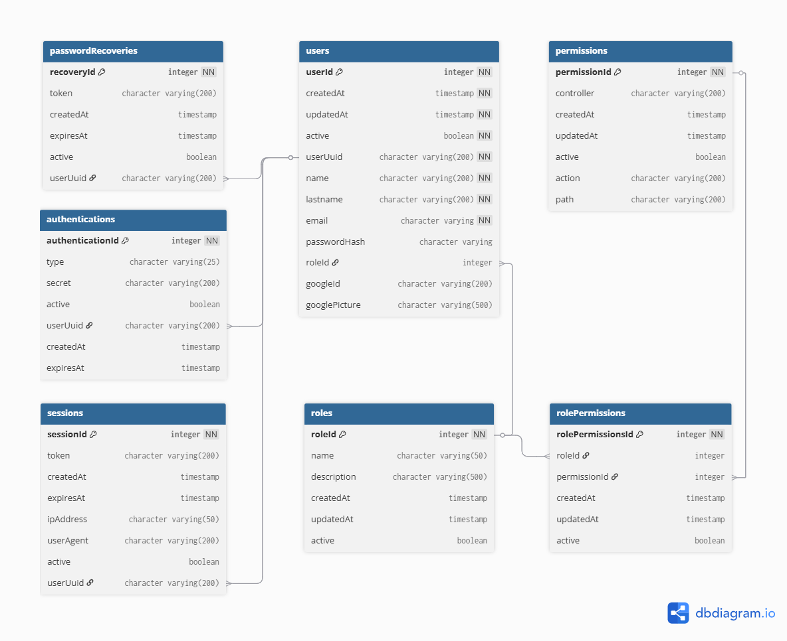

<p align="center">
  <a></a>
</p>

[circleci-image]: https://img.shields.io/circleci/build/github/nestjs/nest/master?token=abc123def456
[circleci-url]: https://circleci.com/gh/nestjs/nes

# 📦 **@lextomato/nest-users**

  [](https://opensource.org/licenses/MIT) [](https://paypal.me/lextomato)

📄 [Documentation in English](./docs/en/README.md)

> ✨ _**@lextomato/nest-users** es una solución integral y lista para usar que simplifica la implementación de autenticación, gestión de usuarios, control de roles y permisos en tus proyectos **NestJS**. Con este paquete, podrás manejar de forma segura y eficiente todo el ciclo de autenticación (incluyendo **login**, **logout**, **register**, **login/register con google**, **cambio de contraseña**, y **recuperación de contraseñas olvidadas**), mientras que también te permite gestionar **usuarios**, **roles**, y **permisos** a través de un completo sistema de **CRUD**._

> ✨ _Además, proporciona un robusto sistema de **Control de Acceso** que garantiza que cada endpoint de **tu aplicación solo sea accesible por usuarios con los permisos adecuados**, basados en los roles asignados. Perfecto para aplicaciones que requieren un control de acceso detallado y una administración centralizada de usuarios._

## 📚 **Tabla de Contenidos**

- [Características](#-características)
- [Requisitos](#-requisitos)
- [Instalación](#️-instalación)
- [Configuración](#️-configuración)
  - [Variables de Entorno](#--variables-de-entorno)
  - [Integracion de Swagger](#--integración-de-swagger)
  - [Configuración de Plantillas Personalizadas para el MailModule](#-️-configuración-de-plantillas-personalizadas-para-el-mailmodule)
- [Uso Básico](#-uso-básico)
- [API](#-api)
- [Especificaciones](#-especificaciones)
- [Otras Características](#-otras-características)
- [Ejemplos](#-ejemplos)
  - [Integracion completa](#️-ejemplo-de-integración-completa)
  - [Protegiendo rutas con roles de un controller en general](#-protegiendo-rutas-con-roles-de-un-controller-en-general)
  - [Protegiendo una ruta en especifico con roles](#-protegiendo-una-ruta-en-especifico-con-roles)
- [Contribuciones](#-contribuciones)
- [Licencia](#-licencia)
- [Donaciones](#-donaciones)
- [Recursos Adicionales](#-recursos-adicionales)

## 🚀 **Características**

- 🔒 **Autenticación Completa**: Implementación de autenticación basada en JWT, incluyendo login, logout, register, login/register con google, validación de sesión, cambio y recuperación de contraseñas.
- 🧒🏻​ **Gestión de Usuarios**: CRUD completo para usuarios con integración de roles.
- ⚡️ **Sistema de Roles y Permisos**: Control de acceso basado en roles y permisos con un guardia de roles integrado.
- 📧​ **Sistema de Correo**: Envío de correos electrónicos para activación de cuentas y recuperación de contraseñas, con configuración dinámica de plantillas y transporte.
- 🪜​ **Modularidad y Escalabilidad**: Módulos independientes y bien integrados que facilitan la escalabilidad y el mantenimiento del código.
- 🛠️ **Fácil Configuración y Extensión**: Configuración sencilla y diseño extensible para adaptarse a diferentes necesidades de proyectos.

---

## 🧩 **Requisitos**

Antes de utilizar **@lextomato/nest-users**, asegúrate de tener instaladas las siguientes dependencias básicas en tu proyecto:

### 📦 **Dependencias Básicas**

1. **NestJS** - El framework principal:

   ```bash
   npm install @nestjs/cli @nestjs/core @nestjs/common @nestjs/config
   ```

2. **TypeORM** - ORM (Object-Relational Mapping) para interactuar con bases de datos:

   ```bash
   npm install typeorm @nestjs/typeorm
   ```

3. **Swagger** (Opcional) - Para la generación de documentación de API automática:
   ```bash
   npm install @nestjs/swagger swagger-ui-express
   ```

### 💡 **Requisitos adicionales**

- **Node.js**: Es necesario tener instalado Node.js (versión 20 o superior).
- **Nest CLI**: Aunque no es obligatorio, te recomendamos utilizar el CLI de NestJS para facilitar la gestión de tu proyecto.
  ```bash
  npm install -g @nestjs/cli
  ```

### 🗄️ **Base de Datos**

Este paquete está diseñado para trabajar principalmente con **PostgreSQL**. Asegúrate de tener un servidor PostgreSQL corriendo y configurado.

Para configurar correctamente la base de datos requerida por **@lextomato/nest-users**, sigue las instrucciones detalladas en el siguiente enlace:

➡️ [Guía de Configuración de la Base de Datos](./database/README.md)



---

## 🛠️ **Instalación**

Puedes instalar el paquete usando npm o yarn:

```bash
npm install @lextomato/nest-users
```

O usando yarn:

```bash
yarn add @lextomato/nest-users
```

---

## ⚙️ **Configuración**

#### 🔘 📄 Variables de Entorno

El paquete se configura a través de variables de entorno según el archivo `.env` en la raiz, el cual debe tener las siguientes variables de entorno:

> ⚠️ _**IMPORTANTE:** este paquete fue diseñado para una base de datos basada en **Postgres SQL**. Se detalla la estructura de la misma para la correcta integracion con el paquete en este enlace [➡️Guía de Configuración de la Base de Datos](./database/README.md)._

<!-- GOOGLE_CLIENT_ID=71618832706-a3rqr4egem8r2tb8bfe5smholijhlbiq.apps.googleusercontent.com
GOOGLE_CLIENT_SECRET=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
GOOGLE_CALLBACK_URL=http://localhost:8080/auth/google/redirect -->

| Variable                       | Descripción                                                                   | Ejemplo                                                                                           |
| ------------------------------ | ----------------------------------------------------------------------------- | ------------------------------------------------------------------------------------------------- |
| `JWT_SECRET`                   | 🔑 _Clave secreta para firmar los tokens JWT._                                | `session-Trrs79`                                                                                  |
| `DB_HOST`                      | 🗄️ _Dirección del host de la base de datos._                                  | `localhost`                                                                                       |
| `DB_PORT`                      | 🛠️ _Puerto de conexión a la base de datos._                                   | `5432`                                                                                            |
| `DB_USER`                      | 👤 _Nombre de usuario para acceder a la base de datos._                       | `db_user`                                                                                         |
| `DB_PASS`                      | 🔐 _Contraseña del usuario de la base de datos._                              | `db_password`                                                                                     |
| `DB_NAME`                      | 📂 _Nombre de la base de datos._                                              | `db_name`                                                                                         |
| `EMAIL_HOST`                   | 📧 _Servidor SMTP utilizado para el envío de correos._                        | `smtp.gmail.com`                                                                                  |
| `EMAIL_PORT`                   | 🔌 _Puerto de conexión para el servidor SMTP._                                | `465`                                                                                             |
| `EMAIL_USER`                   | 👤 _Dirección de correo electrónico utilizada para enviar correos._           | `example@gmail.com`                                                                               |
| `EMAIL_PASS`                   | 🔐 _Contraseña del correo electrónico utilizado._                             | `email_password`                                                                                  |
| `EMAIL_SECURE`                 | ✅ _Indicador de si se debe usar una conexión segura (SSL/TLS)._              | `true (Obligatorio en true)`                                                                      |
| `EMAIL_FROM`                   | ✉️ _Dirección de correo "De" que aparecerá en los correos enviados._          | `"Your App" <example@gmail.com>`                                                                  |
| `APP_DOMAIN`                   | 🌐 _Dominio de la aplicación, utilizado para generar enlaces en los correos._ | `http://localhost:9000` o `https://frontend-domain.com`                                           |
| `ENDPOINT_FROM_RECOVERY_PASS`  | 🔄 _Ruta del frontend para el formulario de recuperación de contraseñas._     | `/#/reset-password`                                                                               |
| `ENDPOINT_TO_ACTIVATE_ACCOUNT` | 🔄 _Ruta del frontend para el formulario de activación de cuenta._            | `/#/activate-account`                                                                             |
| `GOOGLE_CLIENT_ID`             | 🆔 _ID de cliente de Google para autenticación OAuth2._                       | `72318992115-a8pdp4egem2r9hq8bfv9smholikwpaql.apps.googleusercontent.com`                         |
| `GOOGLE_CLIENT_SECRET`         | 🔑 _Secreto de cliente de Google para autenticación OAuth2._                  | `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`                                                             |
| `GOOGLE_CALLBACK_URL`          | 🔄 _URL de callback para la autenticación con Google OAuth2._                 | `http://localhost:8080/auth/google/redirect` o `https://frontend-domain.com/auth/google/redirect` |

#### 🔘 📋 **Integración de Swagger**

##### Tags por Defecto

El paquete **@lextomato/nest-users** incluye una serie de **tags predefinidos en Swagger** que permiten organizar y visualizar de manera clara todas las funcionalidades del servicio, tales como autenticación, gestión de usuarios, roles y permisos. Esto facilita la navegación y el acceso a cada endpoint documentado.

> **Nota**: Estos tags estarán disponibles automáticamente en tu documentación Swagger, previa configuración de Swagger en tu proyecto.

##### Configuración de Swagger

Para habilitar Swagger en tu proyecto, añade el siguiente código en el archivo `main.ts` de tu aplicación:

```typescript
import { NestFactory } from '@nestjs/core';
import { DocumentBuilder, SwaggerModule } from '@nestjs/swagger';
import { AppModule } from './app.module';

async function bootstrap() {
  const app = await NestFactory.create(AppModule);

  // Configuración de Swagger
  const config = new DocumentBuilder()
    .setTitle('API de Usuarios')
    .setDescription(
      'Documentación de la API para la gestión de usuarios, roles y permisos',
    )
    .setVersion('1.0')
    .addBearerAuth()
    .build();

  const document = SwaggerModule.createDocument(app, config);
  SwaggerModule.setup('api', app, document);

  await app.listen(3000);
}
bootstrap();
```

Con esta configuración, podrás visualizar la documentación de tu API generada automáticamente en `http://localhost:3000/api`, donde se mostrarán los **tags de Swagger** correspondientes a las funciones principales de tu servicio.

#### 🔘 ✉️ **Configuración de Plantillas Personalizadas para el `MailModule`**

El `MailModule` de este paquete permite configurar plantillas personalizadas para los correos electrónicos enviados. Estas plantillas son completamente adaptables y deben incluir ciertas **variables clave** que serán reemplazadas dinámicamente cuando se envíe el correo.

##### 📝 **Variables Clave**

Cada plantilla debe incluir las siguientes variables en su sintaxis, las cuales serán reemplazadas automáticamente al enviar el correo:

- **`{{name}}`**: El nombre del destinatario.
- **`{{lastname}}`**: El apellido del destinatario.
- **`{{link}}`**: Un enlace dinámico que varía según el tipo de correo (activación de cuenta, recuperación de contraseña, etc.) que es generado por el sistema.

##### 🔧 **Cómo Configurar Plantillas Personalizadas**

Para configurar las plantillas personalizadas, debes pasar un objeto con las plantillas deseadas al método `forRoot` del `MailModule`. A continuación, se muestra cómo definir y utilizar las plantillas en tu proyecto:

##### **1. Definir Plantillas**

Define tus propias plantillas, especificando el asunto y el cuerpo del correo. Asegúrate de incluir las variables `{{name}}`, `{{lastname}}` y `{{link}}`.

```typescript
const customTemplates = {
  accountActivation: {
    subject: 'Activa tu cuenta en MyApp',
    body: `
      <h1>Hola, {{name}} {{lastname}}</h1>
      <p>Gracias por registrarte en nuestra aplicación. Para activar tu cuenta, haz clic en el siguiente enlace:</p>
      <a href="{{link}}">Activar Cuenta</a>
    `,
  },
  passwordRecovery: {
    subject: 'Recupera tu contraseña en MyApp',
    body: `
      <h1>Hola, {{name}} {{lastname}}</h1>
      <p>Hemos recibido una solicitud para restablecer tu contraseña. Puedes cambiarla haciendo clic en el siguiente enlace:</p>
      <a href="{{link}}">Restablecer Contraseña</a>
    `,
  },
};
```

##### **2. Configurar el `MailModule`**

Al inicializar el `MailModule` en tu aplicación, pasa las plantillas personalizadas que acabas de definir mediante el método `forRoot`.

```typescript
import { Module } from '@nestjs/common';
import { MailModule } from '@lextomato/nest-users';

@Module({
  imports: [
    MailModule.forRoot({
      accountActivation: {
        subject: 'Activa tu cuenta en MyApp',
        body: `
          <h1>Hola, {{name}} {{lastname}}</h1>
          <p>Para activar tu cuenta, haz clic en el enlace:</p>
          <a href="{{link}}">Activar Cuenta</a>
        `,
      },
      passwordRecovery: {
        subject: 'Recupera tu contraseña en MyApp',
        body: `
          <h1>Hola, {{name}} {{lastname}}</h1>
          <p>Haz clic en el siguiente enlace para recuperar tu contraseña:</p>
          <a href="{{link}}">Recuperar Contraseña</a>
        `,
      },
    }),
  ],
})
export class AppModule {}
```

---

## 🚀 **Uso Básico**

Aquí tienes un ejemplo básico de cómo utilizar este paquete:

#### app.module

```typescript
import {
  AuthModule,
  PermissionsModule,
  RolesModule,
  UsersModule,
} from '@lextomato/nest-users';
import { TypeOrmModule } from '@nestjs/typeorm';

@Module({
  imports: [
    ConfigModule.forRoot({
      envFilePath: './.env',
    }),
    TypeOrmModule.forRoot({
      type: 'postgres',
      host: process.env.DB_HOST,
      port: parseInt(process.env.DB_PORT),
      username: process.env.DB_USER,
      password: process.env.DB_PASS,
      database: process.env.DB_NAME,
      autoLoadEntities: true,
      logging: true,
    }),
    AuthModule,
    UsersModule,
    PermissionsModule,
    RolesModule,
  ],
  controllers: [AppController],
  providers: [AppService],
})
export class AppModule {}
```

---

## 📡 **API**

La API de **@lextomato/nest-users** ofrece todas las funcionalidades necesarias para gestionar **usuarios**, **roles**, **permisos**, y **autenticación** en tu aplicación NestJS.

### 🌟 **Endpoints disponibles**

Puedes explorar todos los **endpoints** de la API de forma interactiva a través de nuestra documentación **Swagger** en línea. En ella encontrarás:

- 📄 **Autenticación**: Login, logout, register, login/register con google, recuperación de contraseña y más.
- 👥 **Usuarios**: CRUD completo para la gestión de usuarios.
- 🛡️ **Roles y Permisos**: Gestión de roles y permisos para control de acceso.

### 🌐 **Demo en Línea de Swagger**

👉 Accede a la **documentación Swagger** para ver la lista completa de endpoints y probar cada uno de ellos directamente desde la interfaz interactiva.

**[Documentación Swagger - Demo en Línea](https://lextomato.github.io/nest-users-swagger-ui/)** 🌍

> **⚠️ Nota**: Esta es una demo estática destinada únicamente para **visualización**. La funcionalidad interactiva está deshabilitada, por lo que no es posible realizar pruebas de solicitudes o interactuar con los endpoints.

La demo te permitirá:

- Ver ejemplos de respuestas y formatos de solicitudes.
- Entender cómo interactuar con la API utilizando diferentes métodos y parámetros.

---

## 📖 **Especificaciones**

### 🔑 **`AuthModule`**

- **Autenticación con Google**: Permite a los usuarios iniciar sesión o registrarse utilizando su cuenta de Google mediante OAuth2, integrando el flujo de autenticación de Google de forma segura y sencilla en tu aplicación.
- **Autenticación con JWT**: Implementación robusta de autenticación basada en JWT, que incluye validación de sesiones activas y manejo de tokens revocados para máxima seguridad.
- **Endpoints de Autenticación**: Soporte para login, logout, register, validación de sesión, cambio de contraseña y recuperación de contraseñas olvidadas.
- **Estrategia JWT**: Implementación de la estrategia JWT con validación de tokens en cada solicitud y soporte para revocación de tokens.

### 👥 **`UsersModule`**

- **CRUD de Usuarios**: Funcionalidad completa para la gestión de usuarios, que incluye creación, lectura, actualización y eliminación de usuarios.
- **Integración con Roles**: Los usuarios pueden ser asignados a roles específicos que definen sus permisos y acceso dentro de la aplicación.

### 🛡️ **`RolesModule`** **`PermissionsModule`**

- **Roles Guard**: Un guardia de roles que asegura que solo los usuarios con los roles y permisos adecuados pueden acceder a determinados recursos o endpoints.
- **CRUD de Roles y Permisos**: Gestión completa de roles y permisos, permitiendo definir y controlar el acceso a los diferentes módulos y acciones dentro de la aplicación.
- **Integración con Módulos**: Roles y permisos están integrados directamente con los módulos de autenticación y usuarios, asegurando un control de acceso centralizado.

### ✉️ **`MailModule`**

- **Módulo de Correo**: Soporte para el envío de correos electrónicos, incluyendo correos de activación de cuenta y recuperación de contraseñas.
- **Configuración Dinámica**: Permite configurar el transporte de correo (SMTP) y las plantillas de correo de forma dinámica, adaptándose a las necesidades del entorno.

---

## ✨ **Otras Características**

### 📊 **Modularidad y Escalabilidad**

- **Módulos Independientes**: Cada funcionalidad (auth, usuarios, roles, permisos, mail) está encapsulada en su propio módulo, lo que facilita la escalabilidad y el mantenimiento del código.
- **Integración Fluida**: Los módulos están diseñados para integrarse perfectamente entre sí, proporcionando una base sólida para la construcción de aplicaciones seguras y bien organizadas.

### 🚀 **Fácil Configuración y Extensión**

- **Configuración Sencilla**: Todos los módulos pueden ser configurados fácilmente a través de variables de entorno y opciones de configuración en NestJS.
- **Extensible**: Diseñado para ser extendido, permitiendo agregar nuevas funcionalidades o modificar las existentes sin romper la estructura principal.

---

## 🌟 **Ejemplos**

### 🛠️ Ejemplo de Integración Completa

```typescript
import { Module } from '@nestjs/common';
import { AppController } from './app.controller';
import { AppService } from './app.service';
import { ConfigModule } from '@nestjs/config';
import {
  AuthModule,
  PermissionsModule,
  RolesModule,
  UsersModule,
} from '@lextomato/nest-users';
import { TypeOrmModule } from '@nestjs/typeorm';

@Module({
  imports: [
    ConfigModule.forRoot({
      envFilePath: './.env',
    }),
    TypeOrmModule.forRoot({
      type: 'postgres',
      host: process.env.DB_HOST,
      port: parseInt(process.env.DB_PORT),
      username: process.env.DB_USER,
      password: process.env.DB_PASS,
      database: process.env.DB_NAME,
      autoLoadEntities: true,
      logging: true,
    }),
    AuthModule,
    UsersModule,
    PermissionsModule,
    RolesModule,
  ],
  controllers: [AppController],
  providers: [AppService],
})
export class AppModule {}
```

### 🔐 Protegiendo Rutas con Roles de un Controller en general

```typescript
import { Controller, Get, UseGuards } from '@nestjs/common';
import { RolesGuard } from '@lextomato/nest-users';
import { JwtAuthGuard, RolesGuard } from '@lextomato/nest-users';

@Controller('admin')
@UseGuards(JwtAuthGuard, RolesGuard) // <-- Usar decorador en el controller principal
export class AdminController {
  @Get('dashboard')
  getDashboard() {
    return 'This is the admin dashboard';
  }

  @Get('profile')
  getDashboard() {
    return 'This is the user profile';
  }
}
```

> _**NOTA:** en este caso se protege todas las rutas del controller 'admin' que incluyen las rutas **@Get('dashboard')** y **@Get('profile')**._

### 🔐 Protegiendo una Ruta en especifico con Roles

```typescript
import { Controller, Get, UseGuards } from '@nestjs/common';
import { RolesGuard } from '@lextomato/nest-users';
import { JwtAuthGuard, RolesGuard } from '@lextomato/nest-users';

@Controller('admin')
export class AdminController {
  @Get('dashboard')
  getDashboard() {
    return 'This is the admin dashboard';
  }

  @Get('profile')
  @UseGuards(JwtAuthGuard, RolesGuard) // <-- Usar decorador en Ruta especifica
  getDashboard() {
    return 'This is the user profile';
  }
}
```

> _**NOTA:** en este caso se protege solo las rutas del controller que tienen el decorador respectivo. Para este caso solo **@Get('profile')**._

---

## 🧑‍💻 **Contribuciones**

Las contribuciones son bienvenidas. Por favor, sigue estos pasos para contribuir:

1. Haz un fork del proyecto desde [aquí](https://github.com/lextomato/nest-users).
2. Crea una nueva rama (`git checkout -b feature/new-function`).
3. Haz commit de tus cambios (`git commit -am 'Añadir nueva función'`).
4. Haz push a la rama (`git push origin feature/new-function`).
5. Crea un nuevo Pull Request.

---

## 🔑 **Licencia**

Este proyecto está licenciado bajo la Licencia **MIT** - consulta el archivo [📄LICENSE](./LICENSE) para más detalles.

---

## 💰 **Donaciones**

Si te gusta este proyecto y te gustaría apoyarlo, considera hacer una donación vía PayPal. Tu apoyo ayuda a mantener este proyecto y mejorar sus funcionalidades.

[](https://paypal.me/lextomato)

---

### 🔗 **Recursos Adicionales**

- 🛠️ [Issues](https://github.com/lextomato/nest-users/issues) _(Link a la página de Issues para reportar problemas o sugerir mejoras)._
- 📘 [Documentación de NestJS](https://docs.nestjs.com) _(Para obtener más información sobre cómo funciona NestJS)._

---

🚀 ¡Gracias por usar **@lextomato/nest-users** Si tienes alguna pregunta o sugerencia, no dudes en abrir un issue o contribuir al proyecto.
