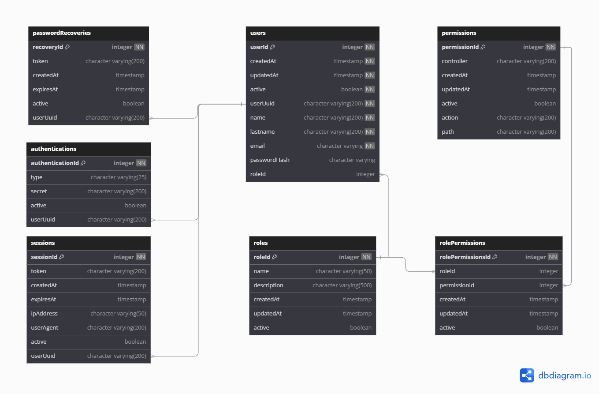

# 🗄️ Base de Datos para **📦@lextomato/nest-users**

> ✨ _**@lextomato/nest-users** necesita una base de datos configurada en PostgreSQL para operar correctamente. A continuación, te mostramos paso a paso cómo configurar la estructura de la base de datos necesaria para que el paquete funcione sin problemas._

## 📚 **Tabla de Contenidos**

- [Estructuras de Tablas](#️-estructura-de-tablas)
- [Primary Keys](#-primary-keys)
- [Unique Constraints](#-unique-constraints)
- [Foreign Keys](#-foreign-keys)
- [Default Sequences](#-default-sequences)
- [Configuracion automatica](#-instrucciones-para-configurar-la-base-de-datos)

---

## 🗂️ Estructura de Tablas



### 1. Tabla: `public.authentications`

```sql
CREATE TABLE public.authentications (
    "authenticationId" integer NOT NULL,
    "type" character varying(25),
    "secret" character varying(200),
    "active" boolean DEFAULT true,
    "userUuid" character varying(200)
);
```

### 2. Tabla: `public.passwordRecoveries`

```sql
CREATE TABLE public."passwordRecoveries" (
    "recoveryId" integer NOT NULL,
    "token" character varying(200),
    "createdAt" timestamp without time zone DEFAULT now(),
    "expiresAt" timestamp without time zone,
    "active" boolean DEFAULT true,
    "userUuid" character varying(200)
);
```

### 3. Tabla: `public.permissions`

```sql
CREATE TABLE public.permissions (
    "permissionId" integer NOT NULL,
    "controller" character varying(200),
    "createdAt" timestamp without time zone DEFAULT now(),
    "updatedAt" timestamp without time zone DEFAULT now(),
    "active" boolean DEFAULT true,
    "action" character varying(200),
    "path" character varying(200)
);
```

### 4. Tabla: `public.rolePermissions`

```sql
CREATE TABLE public."rolePermissions" (
    "rolePermissionsId" integer NOT NULL,
    "roleId" integer,
    "permissionId" integer,
    "createdAt" timestamp without time zone DEFAULT now(),
    "updatedAt" timestamp without time zone DEFAULT now(),
    "active" boolean DEFAULT true
);
```

### 5. Tabla: `public.roles`

```sql
CREATE TABLE public.roles (
    "roleId" integer NOT NULL,
    "name" character varying(50),
    "description" character varying(500),
    "createdAt" timestamp without time zone DEFAULT now(),
    "updatedAt" timestamp without time zone DEFAULT now(),
    "active" boolean DEFAULT true
);
```

### 6. Tabla: `public.sessions`

```sql
CREATE TABLE public.sessions (
    "sessionId" integer NOT NULL,
    "token" character varying(200),
    "createdAt" timestamp without time zone DEFAULT now(),
    "expiresAt" timestamp without time zone,
    "ipAddress" character varying(50),
    "userAgent" character varying(200),
    "active" boolean DEFAULT true,
    "userUuid" character varying(200)
);
```

### 7. Tabla: `public.users`

```sql
CREATE TABLE public.users (
    "userId" integer NOT NULL,
    "createdAt" timestamp without time zone DEFAULT now() NOT NULL,
    "updatedAt" timestamp without time zone DEFAULT now() NOT NULL,
    "active" boolean DEFAULT true NOT NULL,
    "userUuid" character varying(200) NOT NULL,
    "name" character varying(200) NOT NULL,
    "lastname" character varying(200) NOT NULL,
    "email" character varying NOT NULL,
    "passwordHash" character varying,
    "roleId" integer DEFAULT 1
);
```

---

## 🔑 Primary Keys

```sql
ALTER TABLE ONLY public.authentications
    ADD CONSTRAINT authentications_pkey PRIMARY KEY ("authenticationId");

ALTER TABLE ONLY public."passwordRecoveries"
    ADD CONSTRAINT "passwordRecoveries_pkey" PRIMARY KEY ("recoveryId");

ALTER TABLE ONLY public.permissions
    ADD CONSTRAINT permissions_pkey PRIMARY KEY ("permissionId");

ALTER TABLE ONLY public."rolePermissions"
    ADD CONSTRAINT "rolePermissions_pkey" PRIMARY KEY ("rolePermissionsId");

ALTER TABLE ONLY public.roles
    ADD CONSTRAINT roles_pkey PRIMARY KEY ("roleId");

ALTER TABLE ONLY public.sessions
    ADD CONSTRAINT sessions_pkey PRIMARY KEY ("sessionId");

ALTER TABLE ONLY public.users
    ADD CONSTRAINT users_pkey PRIMARY KEY ("userId");
```

---

## 🎯 Unique Constraints

```sql
ALTER TABLE ONLY public."passwordRecoveries"
    ADD CONSTRAINT "passwordRecoveries_token_key" UNIQUE ("token");

ALTER TABLE ONLY public."rolePermissions"
    ADD CONSTRAINT "rolePermissions_roleId_permissionId_key" UNIQUE ("roleId", "permissionId");

ALTER TABLE ONLY public.roles
    ADD CONSTRAINT roles_name_key UNIQUE ("name");

ALTER TABLE ONLY public.sessions
    ADD CONSTRAINT sessions_token_key UNIQUE ("token");

ALTER TABLE ONLY public.users
    ADD CONSTRAINT users_email_key UNIQUE ("email");

ALTER TABLE ONLY public.users
    ADD CONSTRAINT "users_userUuid_key" UNIQUE ("userUuid");
```

---

## 🔗 Foreign Keys

```sql
ALTER TABLE ONLY public.authentications
    ADD CONSTRAINT "authentications_userUuid_fkey" FOREIGN KEY ("userUuid") REFERENCES public.users("userUuid") NOT VALID;

ALTER TABLE ONLY public."passwordRecoveries"
    ADD CONSTRAINT "passwordRecoveries_userUuid_fkey" FOREIGN KEY ("userUuid") REFERENCES public.users("userUuid") NOT VALID;

ALTER TABLE ONLY public."rolePermissions"
    ADD CONSTRAINT "rolePermissions_permissionId_fkey" FOREIGN KEY ("permissionId") REFERENCES public.permissions("permissionId");

ALTER TABLE ONLY public."rolePermissions"
    ADD CONSTRAINT "rolePermissions_roleId_fkey" FOREIGN KEY ("roleId") REFERENCES public.roles("roleId");

ALTER TABLE ONLY public.sessions
    ADD CONSTRAINT "sessions_userUuid_fkey" FOREIGN KEY ("userUuid") REFERENCES public.users("userUuid") NOT VALID;

ALTER TABLE ONLY public.users
    ADD CONSTRAINT "users_roleId_fkey" FOREIGN KEY ("roleId") REFERENCES public.roles("roleId") NOT VALID;
```

---

## 📜 Default Sequences

```sql
ALTER TABLE ONLY public."passwordRecoveries" ALTER COLUMN "recoveryId" SET DEFAULT nextval('public."passwordRecoveries_recoveryId_seq"'::regclass);
ALTER TABLE ONLY public.permissions ALTER COLUMN "permissionId" SET DEFAULT nextval('public."permissions_permissionId_seq"'::regclass);
ALTER TABLE ONLY public."rolePermissions" ALTER COLUMN "rolePermissionsId" SET DEFAULT nextval('public."rolePermissions_rolePermissionsId_seq"'::regclass);
ALTER TABLE ONLY public.roles ALTER COLUMN "roleId" SET DEFAULT nextval('public."roles_roleId_seq"'::regclass);
ALTER TABLE ONLY public.sessions ALTER COLUMN "sessionId" SET DEFAULT nextval('public."sessions_sessionId_seq"'::regclass);
ALTER TABLE ONLY public.users ALTER COLUMN "userId" SET DEFAULT nextval('public."users_userId_seq"'::regclass);
```

---

## 🚀 Instrucciones para Configurar la Base de Datos

> ✨ _Puedes usar el script `init.sql` para crear toda la estructura de la base de datos automáticamente.._

### Requisitos Previos

Antes de ejecutar el script `init.sql`, asegúrate de tener lo siguiente:

1. **PostgreSQL instalado**: Si no tienes PostgreSQL instalado, puedes descargarlo desde [aquí](https://www.postgresql.org/download/).
2. **Base de datos creada**: Crea una nueva base de datos para tu proyecto si aún no lo has hecho. Por ejemplo:
   ```bash
   createdb my_database
   ```
3. **Acceso a tu base de datos**: Asegúrate de tener las credenciales necesarias para conectarte a tu base de datos.

### Ejecución del Script `init.sql`

Para configurar la base de datos con la estructura necesaria, sigue los siguientes pasos:

1. **Descarga el archivo `init.sql`**: Puedes encontrarlo en el directorio `/database/` de este repositorio o descargarlo desde el enlace proporcionado.
2. **Conéctate a PostgreSQL**: Usa el siguiente comando para conectarte a tu base de datos desde la terminal o consola:

   ```bash
   psql -U <tu-usuario> -d <nombre-de-tu-base-de-datos>
   ```

3. **Ejecuta el archivo `init.sql`**: Una vez conectado, ejecuta el script para crear las tablas y secuencias. Puedes usar el siguiente comando:

   ```bash
   psql -U <tu-usuario> -d <nombre-de-tu-base-de-datos> -f /ruta/donde/se/encuentra/init.sql
   ```

   Asegúrate de reemplazar `/<ruta/donde/se/encuentra/init.sql>` con la ruta real donde está ubicado el archivo `init.sql`.

4. **Verifica la estructura de la base de datos**: Una vez ejecutado el script, puedes revisar las tablas creadas usando el comando:
   ```sql
   \dt
   ```
   Este comando te mostrará todas las tablas creadas en la base de datos.

### Consideraciones Adicionales

- **Modificaciones personalizadas**: Si necesitas hacer modificaciones a la estructura antes de la ejecución, puedes editar el archivo `init.sql` para ajustarlo a tus necesidades.
- **Restauración de la base de datos**: Si ya tienes una base de datos existente y solo necesitas restaurar la estructura, el archivo `init.sql` se encargará de crear las tablas sin necesidad de eliminar datos existentes.

---

### Ejemplo Completo

```bash
psql -U postgres -d my_database -f /documents/init.sql
```

Este ejemplo creará todas las tablas, secuencias y restricciones en la base de datos `my_database` usando el usuario `postgres`.
