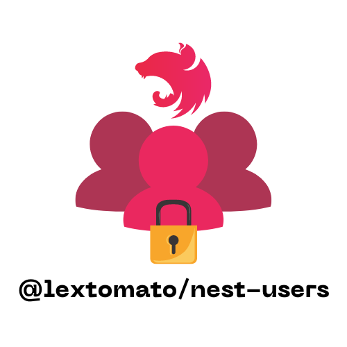

<p align="center">
  <a></a>
</p>

[circleci-image]: https://img.shields.io/circleci/build/github/nestjs/nest/master?token=abc123def456
[circleci-url]: https://circleci.com/gh/nestjs/nes

[](https://opensource.org/licenses/MIT) [](https://paypal.me/lextomato)

📄 [Documentación en Español](/README.md)

> ✨ **@lextomato/nest-users** is an all‑in‑one, ready‑to‑use solution that streamlines the implementation of authentication, user management, role‑based access control and permissions in your **NestJS** projects. It provides a secure, end‑to‑end auth flow (including **login**, **logout**, **register**, **Google OAuth2**, **password change** and **forgot‑password recovery**) while exposing full **CRUD** for **users**, **roles** and **permissions**.

> ✨ It also ships with a robust **Access Control System**, ensuring that every endpoint in **your application is only accessible to users with the proper permissions**, based on their assigned roles. Perfect for apps that require fine‑grained access control and centralized user administration.

# 🧰✨ Nest Users Kit

This monorepo bundles **everything you need** to add auth, users, roles and permissions to your **NestJS** APIs in minutes.

| 📦 Package                    | 🚀 Latest                                                                            | 🔍 Description                                                                    |
| ----------------------------- | ------------------------------------------------------------------------------------ | --------------------------------------------------------------------------------- |
| **@lextomato/nest‑users**     |      | “Black‑box” library (only compiled `dist/`) with ready‑to‑import modules.         |
| **@lextomato/nest‑users‑cli** |  | 🧙‍♂️ CLI that scaffolds an editable Nest project with those modules pre‑configured. |

---

## ⚡️ Quick try

```bash
# 🏗️ Generate a fully‑configured project
npx @lextomato/nest-users-cli init my-app
cd my-app
npm run start:dev
```

```bash
# 📚 Just the library to plug into an existing project
npm i @lextomato/nest-users
```

> 👉 **Online Swagger demo:** https://lextomato.github.io/nest-users-swagger-ui/

---

## 📂 Repo layout

```
.
├─ packages/
│  ├─ core/   # → @lextomato/nest-users
│  └─ cli/    # → @lextomato/nest-users-cli
└─ docs/      # diagrams, assets…
```

- 📖 **Full core documentation:** [Documentation](/docs/en/README_core.md)
- 🖥️ **CLI user guide:** [README.md](/docs/en/README_cli.md)

---

## 🤝 Contributing

Contributions are welcome!

1. Fork the repo from [here](https://github.com/lextomato/nest-users).
2. Create your branch (`git checkout -b feature/new-feature`).
3. Commit your changes (`git commit -am 'Add new feature'`).
4. Push the branch (`git push origin feature/new-feature`).
5. Open a Pull Request.

---

## 🔑 License

This project is licensed under the **MIT** License – see [📄LICENSE](./LICENSE) for details.

---

## 💰 Donations

If you like the project and want to support it, consider a PayPal donation. Your support helps keep the project alive and improving.

[](https://paypal.me/lextomato)

---

### 🔗 Additional resources

- 🛠️ [Issues](https://github.com/lextomato/nest-users/issues) – report problems or suggest improvements.
- 📘 [NestJS Documentation](https://docs.nestjs.com) – to learn more about the framework.

---

🚀 **Thanks for using @lextomato/nest-users!** If you have questions or suggestions, feel free to open an issue or contribute.
